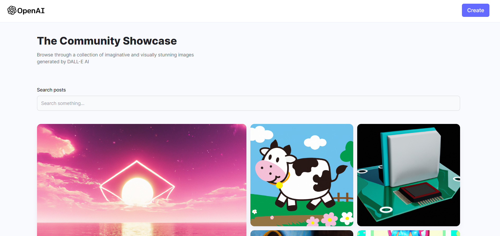

<h1 align="center">
  <br>
  DALL-E Clone
  <br>
</h1>

<p align="center">
  <strong>A MERN Stack Project Powered by OpenAI API and Cloudinary</strong>
</p>

<p align="center">
  
</p>

## Table of Contents

- [About](#about)
- [Features](#features)
- [Getting Started](#getting-started)
- [Usage](#usage)
- [Technologies](#technologies)

## About

DALL-E Clone is a project inspired by OpenAI's DALL-E, showcasing the power of generative AI. This MERN stack application allows users to generate images from text descriptions. It utilizes the OpenAI API for image generation and Cloudinary for image storage.

## Features

- **Text-to-Image Generation:**
  - Enter a text description, and the app generates an image based on it using OpenAI's DALL-E.

- **Image Storage:**
  - Uploaded and generated images are stored on Cloudinary for easy access and sharing.

- **MongoDB Integration:**
  - User data, including uploaded images and descriptions, is stored in a MongoDB database.

# Getting Started

To run the DALL-E Clone project locally, follow these steps:

1. **Clone the Repository:**
   ```bash
   git clone https://github.com/yourusername/dall-e-clone.git
   cd dall-e-clone

## Install server dependencies
```
cd server
npm install
```

## Install client dependencies
```
cd ../client
npm install
```
Create a .env file in the server directory and configure your environment variables. Include your OpenAI API key, Cloudinary credentials and Mongo_DB url such as.

```
OPENAI_API_KEY =

MONGODB_URL =

CLOUDINARY_CLOUD_NAME =
CLOUDINARY_API_KEY =
CLOUDINARY_API_SECRET =
```
## From the server directory
```
npm start
```

## From the client directory
`npm run dev`

Open your web browser and navigate to http://localhost:5173 to use DALL-E Clone.

# Usage
### Generate Images:

Enter a text description in the input field.
Click the "Generate Image" button.
The generated image will be displayed.
### View and Share Images:

All generated and uploaded images are available in your account.
Click on an image to view it in full size.
Use the sharing options to share images with others.

# Technologies
### Frontend:

React for building the user interface.
Axios for making API requests.
### Backend:

Node.js and Express for the server.
MongoDB for storing user data.
### AI Integration:

OpenAI API for text-to-image generation.
Cloudinary for image storage and retrieval.

